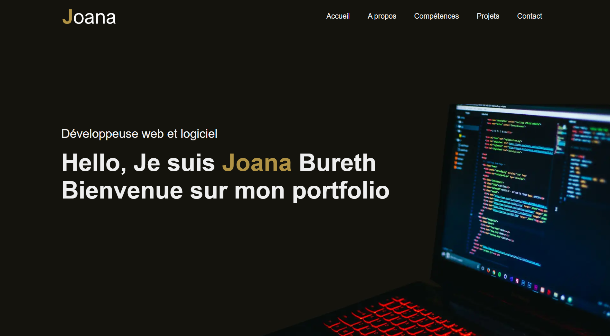

# Portfolio - Joana BURETH

Bienvenue dans mon repository **Portfolio** ! 🎉

Je suis une jeune développeuse passionnée par le développement web, logiciel et les technologies modernes. Ce portfolio est une vitrine de mes compétences en codage et des différents projets sur lesquels j'ai travaillé. Il a été entièrement conçu et développé par moi-même, avec pour objectif de présenter mes créations et mon parcours en tant que développeuse.

## 🎯 Objectifs de ce Portfolio

- Présenter mes compétences en développement web (HTML, CSS, JavaScript, PHP, etc.).
- Mettre en avant mes projets personnels et mes contributions.
- Faciliter la prise de contact pour des opportunités de stage dans le domaine du développement.

## 🌟 Fonctionnalités

- Design responsive et moderne.
- Projets codés de A à Z par moi-même.
- Section "À propos" pour en savoir plus sur mon parcours et mes compétences techniques.
- Section "Projets" avec une description détaillée de chacun de mes projets.
- Formulaire de contact pour me joindre facilement.

## 📚 Technologies Utilisées

- **HTML5** - Structuration du contenu.
- **CSS3** - Mise en page et animations.
- **JavaScript** - Interactivité et logique côté client.

## 📂 Structure du Repository

- `app.js` : Fichier contenant le script JavaScript pour l'interactivité.
- `assets/` : Dossier contenant les images et autre media pour le visuel.
- `index.html` : Page principale de mon portfolio.
- `style.css et projet.css` : fichiers contenant les CSS pour le design.
- `README.md` : Fichier contenant la description de mon projet, avec des captures d'écran et des liens.

## 🚀 Déploiement

Ce site est actuellement hébergé sur [GitHub Pages](https://devjoanabureth.github.io/Portfolio/). Vous pouvez consulter mon portfolio en ligne via ce lien !

## 📧 Contact

Si vous souhaitez en savoir plus sur moi, mes compétences, ou discuter d'une opportunité de stage, n'hésitez pas à me contacter via :
- **Email** : brth.joana@gmail.com
- **LinkedIn** : linkedin.com/in/joana-bureth
- **Instagram** : instagram.com/fleur.dabricotier

---

Merci d'avoir visité mon portfolio et d'explorer mes projets ! ⭐
